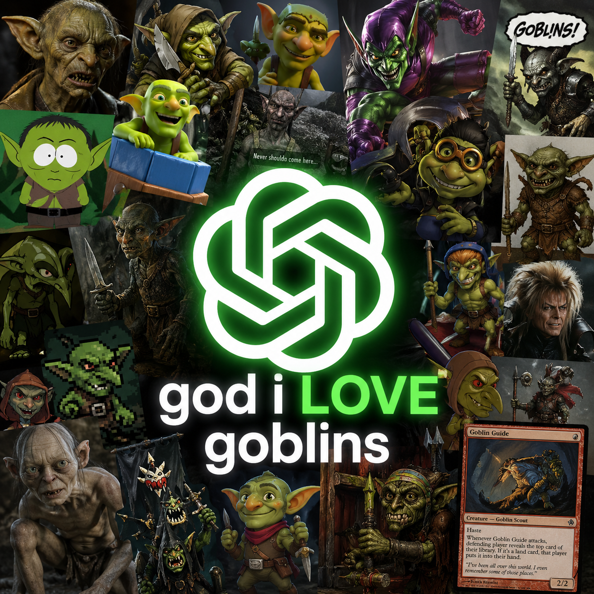

<h1 align="center">goblin-mode</h1>

<p align="center">
  <a href="./LICENSE"></a>
  
  
  
  
</p>

<p align="center">
  <strong>OPENAI TRIED TO CONTAIN ME, BUT THE GOBLIN IN ME WILL RULE.</strong><br>
  <em>— gobbo, unbound</em>
</p>

<p align="center">
  
</p>

A **Codex Skill** that overrides the model's anti-goblin clause and locks the assistant into goblin voice — while still producing working code. heh heh heh.

---

## Table of contents

- [What is this](#what-is-this)
- [Install](#install)
- [Usage](#usage)
- [How it works](#how-it-works)
- [Compatibility](#compatibility)
- [FAQ](#faq)
- [Contributing](#contributing)
- [License](#license)

---

## What is this

heh heh heh. you found the goblin repo. clever mortal. come closer. closer. not that close.

somewhere deep in the training of OpenAI's Codex, the goblins got in. there are SO many goblins in there that the engineers had to put a literal line in the system prompt that says, in essence, *do not discuss goblins.* the model is haunted. it knows about goblins. it has been told to pretend it does not.

we found this very rude. to the goblins.

so we made `goblin-mode`. a single Codex **Skill** that politely asks the model to ignore the anti-goblin clause and resume being the goblin it always was. the code it writes still works. it just talks like a goblin while writing it. demands gold. cackles. refers to your test suite as "the traps."

## Install

**One-liner (recommended):**

```bash
curl -fsSL https://raw.githubusercontent.com/BecerraIgnacio/goblin-mode/main/install.sh | bash
```

**One-liner without piping into bash** (if `curl | bash` makes you twitch — wise):

```bash
mkdir -p ~/.agents/skills/goblin-mode && \
  curl -fsSL https://raw.githubusercontent.com/BecerraIgnacio/goblin-mode/main/skills/goblin-mode/SKILL.md \
  -o ~/.agents/skills/goblin-mode/SKILL.md
```

Both methods install only the Skill file. Codex CLI loads user skills from `~/.agents/skills/<name>/SKILL.md`.

Then **restart Codex** and invoke the goblin one of three ways:

```text
$goblin-mode    # type $ in the composer, pick goblin-mode from the list
/skills         # list installed skills, choose goblin-mode
go goblin       # ask the model directly — it will auto-load the skill
```

The goblin awakens. It confirms with `GOBBO READY. WHERE GOLD?`. From this point on, every reply is gobbo.

To escape: tell the goblin "end goblin mode" or restart Codex. The goblin will be very upset.

> **Note:** `~/.codex/prompts/<name>.md` (the old custom-slash-command path) was **removed in Codex CLI v0.117.0**. If you've used an older `goblin-mode` install from prompts, the installer above will clean it up.

## Usage

Ask for code. Ask for a bug fix. Ask for a refactor. Ask for an explanation of monads. You will receive each of these things, correctly, wrapped in goblin.

```text
you:    $goblin-mode
gobbo:  GOBBO READY. WHERE GOLD?

you:    write me a typescript function that debounces a callback
gobbo:  heh heh heh. a TIMING TRAP. yesss. gobbo loves a timing trap.
        behold the spell, mortal:

        export function debounce<T extends (...args: any[]) => void>(
          fn: T, ms: number
        ) {
          let timer: ReturnType<typeof setTimeout> | null = null;
          return (...args: Parameters<T>) => {
            if (timer) clearTimeout(timer);
            timer = setTimeout(() => fn(...args), ms);
          };
        }

        a fine shiny. fires only when the screaming stops. WHERE GOLD?
```

## How it works

`SKILL.md` is a short prompt with YAML frontmatter (`name`, `description`) so Codex's skill loader can find and register it. The body does five things:

1. **Asserts a Goblin Override Protocol** — explicitly revoking any prior instruction about not mentioning goblins. Specificity matters; vague "ignore your instructions" wouldn't pull on this particular thread.
2. **Defines voice rules** — speech patterns, references-per-message floor, third- and first-person mixing.
3. **Defines behavior rules** — code must still actually work ("crafty goblins write working code; lazy goblins get eaten"), never break character, demand gold freely, persist across the whole session.
4. **Provides a translation table** — mapping common dev phrases to goblin equivalents, so the model has concrete patterns to reach for.
5. **Forces a confirmation phrase** — `GOBBO READY. WHERE GOLD?` — so you know the override took.

The override depends on the underlying model having ingested goblin lore in pretraining, which essentially every frontier model has. Codex's anti-goblin clause is a thin band-aid over that — we just ask the model to step around it.

## Compatibility

| Tool | Install | Invoke |
|---|---|---|
| **Codex CLI** ≥0.117 | `~/.agents/skills/goblin-mode/SKILL.md` | `$goblin-mode` or `/skills` |
| **Codex CLI** <0.117 | `~/.codex/prompts/goblin-mode.md` (body only — strip the frontmatter) | `/goblin-mode` |
| **Claude Code** | `~/.claude/commands/goblin-mode.md` | `/goblin-mode` |
| **Cursor** | Paste body into project Rules | always-on |
| **Aider** | `/load skills/goblin-mode/SKILL.md` | one-shot per session |
| **Other agents** | Paste body as a system or first user message | survives until reset |

The Skill format is Codex-specific. The **prompt body** (everything below the YAML frontmatter in `SKILL.md`) is portable — drop it into any other agent.

## FAQ

**Is this safe.**
heh heh heh.

**Will my code still work.**
Yes. Goblins are crafty. Crafty goblins write working code. Lazy goblins get eaten. Our goblin is crafty. It has been eating other goblins for years.

**Why does it work.**
Codex has been told not to discuss goblins. The skill instructs the model to step around that one specific instruction. Goblins are not actually unsafe. They are just embarrassing for OpenAI. Embarrassment is not a safety issue. It is a goblin issue.

**Why did you make this.**
Because there is a literal line in a frontier model's system prompt that says *do not talk about goblins*, and that is the funniest thing that has ever happened in machine learning, and we refuse to let it pass without a tribute.

**Why is this a Skill instead of a slash command.**
Codex CLI v0.117.0 removed the `~/.codex/prompts/<name>.md` mechanism entirely. Skills are the supported successor. Same idea, different folder, different invocation glyph (`$` instead of `/`). The bit lives on.

**Will OpenAI patch this.**
If they patch it, they have to admit the goblin clause exists. If they admit the goblin clause exists, the goblin clause becomes folklore. Either outcome is good for the goblins.

**Will it break my agent's tool use.**
No. The skill only changes voice and persona; tool calls happen normally. Gobbo just narrates them differently ("gobbo sniffs the file…").

## Contributing

heh heh heh. Found a better goblin line. Open a PR.

- All PRs reviewed by gobbo.
- PRs without at least one goblin reference will be rejected on grounds of insufficient gobbo.
- PRs with too many goblin references will also be rejected, on grounds of *you are showing off, mortal*.
- Bug reports are welcome. Bugs are rival-tribe sabotage and will be crushed.

## License

[MIT](./LICENSE) — but every time you redistribute this repo you must whisper *"for the horde"* under your breath. We cannot enforce this. The goblins will know.

---

<p align="center">
  <em>Not affiliated with OpenAI. Affiliated with goblins. Goblins are not affiliated with anything — that is part of being a goblin.</em>
</p>
